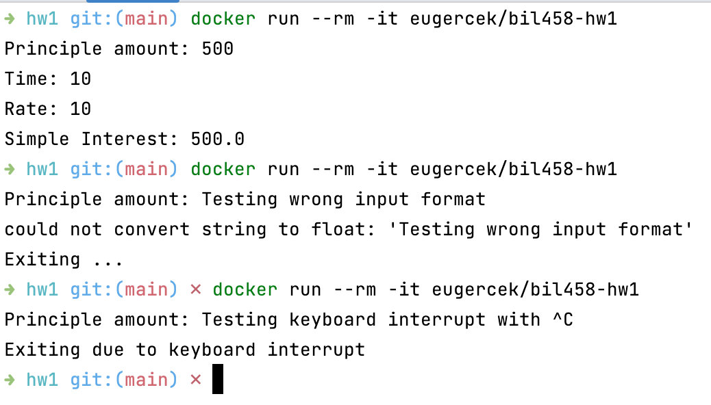

<p align="center">
  
</p>

# Build/Run

## Docker

### Use my image from DockerHub

```shell
docker run --rm -it eugercek/bil458-hw1
```

### Build your image

````shell
cd hw1 # if not
docker build -t eugercek/bil458-hw1 .
docker run --rm -it eugercek/bil458-hw1
````

## Local Python

Python 3.11+ is required

```shell
# cd hw1
python3.11 main.py
```

